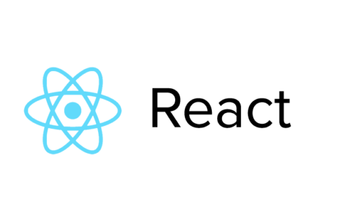

# React boilerplate

### Quick start

Clone this repo using `git clone  https://github.com/jsperov/UI-Kit.git <YOUR_PROJECT_NAME>`
Move to the project directory `cd <YOUR_PROJECT_NAME>`
Run command in your terminal `npm start`

### Used

- React
- Typescript
- Jest

##### Author

[@Andrey_Perov](https://github.com/jsperov)
